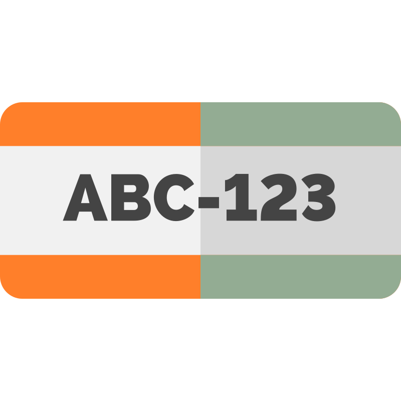

<div align="center">
  <picture>
    
  </picture>
<br>

<h2>Omni-LPR</h2>

[](https://github.com/habedi/omni-lpr/actions/workflows/tests.yml)
[](https://codecov.io/gh/habedi/omni-lpr)
[](https://www.codefactor.io/repository/github/habedi/omni-lpr)
[](https://github.com/habedi/omni-lpr)
[](https://pypi.org/project/omni-lpr/)
[](https://github.com/habedi/omni-lpr/blob/main/LICENSE)
<br>
[&logo=docker&logoColor=white&style=flat&color=007ec6)](https://github.com/habedi/omni-lpr/pkgs/container/omni-lpr-cpu)
[&logo=docker&logoColor=white&style=flat&color=007ec6)](https://github.com/habedi/omni-lpr/pkgs/container/omni-lpr-openvino)
[&logo=docker&logoColor=white&style=flat&color=007ec6)](https://github.com/habedi/omni-lpr/pkgs/container/omni-lpr-cuda)

A multi-interface (REST and MCP) server for automatic license plate recognition

</div>

---

Omni-LPR is a self-hostable server that provides automatic license plate recognition (ALPR) capabilities via a REST API
and over the Model Context Protocol (MCP).
It can be used both as a standalone ALPR microservice and as an ALPR toolbox for AI agents and LLMs.

### Why Omni-LPR?

Using Omni-LPR can have the following benefits:

- **Decoupling:** your main application can be in any programming language, and it won't need Python or ML dependencies.
- **Multiple Interfaces:** you can use the ALPR service via a standard REST API, or the MCP for AI agent integration.
- **Ready-to-Deploy:** easy to deploy and start with pre-built Docker images.
- **Hardware Acceleration:** support for generic CPUs (ONNX), Intel CPUs (OpenVINO), and NVIDIA GPUs (CUDA).
- **Asynchronous I/O:** built on Starlette for high-performance, non-blocking I/O.
- **Scalability:** the service can be scaled independently of your main application.

> [!IMPORTANT]
> Omni-LPR is in early development, so bugs and breaking API changes are expected.
> Please use the [issues page](https://github.com/habedi/omni-lpr/issues) to report bugs or request features.

---

### Getting Started

You can run Omni-LPR either by installing it as a Python library or by using a ready-to-use Docker image.

#### Method 1

You can install Omni-LPR via `pip` or any other Python package manager.

```sh
pip install omni-lpr
````

By default, the server will use the CPU-enabled ONNX models.
You can use models that are optimized for specific hardware backends by installing the optional dependencies:

- **OpenVINO (Intel CPUs):** `pip install omni-lpr[openvino]`
- **CUDA (NVIDIA GPUs):** `pip install omni-lpr[cuda]`

##### Starting the Server

To start the server, run the `omni-lpr` command:

```sh
omni-lpr --host 0.0.0.0 --port 8000
```

#### Method 2

Pre-built Docker images are available from the [GitHub Container Registry](https://github.com/habedi/omni-lpr/packages).
You can build the images locally or pull them from the registry.

##### Building the Docker Images

You can build the Docker images for different backends using the provided [Makefile](Makefile).

- **CPU (default):** `make docker-build-cpu`
- **OpenVINO:** `make docker-build-openvino`
- **CUDA:** `make docker-build-cuda`

##### Running the Container

When you have built or pulled the images, you can run them using the following commands:

- **CPU Image (ONNX):**
  ```sh
  # Use locally built image
  make docker-run-cpu

  # Or from the GitHub Container Registry
  docker run --rm -it -p 8000:8000 ghcr.io/habedi/omni-lpr-cpu:TAG
  ```

- **CPU Image (OpenVINO):**
  ```sh
  # Use locally built image
  make docker-run-openvino

  # Or from the GitHub Container Registry
  docker run --rm -it -p 8000:8000 ghcr.io/habedi/omni-lpr-openvino:TAG
  ```

- **GPU Image (CUDA):**
  ```sh
  # Use locally built image
  make docker-run-cuda

  # Or from the GitHub Container Registry
  docker run --rm -it --gpus all -p 8000:8000 ghcr.io/habedi/omni-lpr-cuda:TAG
  ```

> [!NOTE]
> The `TAG` in the above commands is a release tag like `0.2.0` or `latest` for the latest development version.
> You can find the available tags in the [GitHub Container Registry](https://github.com/habedi/omni-lpr/packages).

---

### Documentation

The server exposes its functionality via two interfaces: REST API and MCP.
A health check endpoint is also available at `GET /api/health`.
It also can be configured using command-line arguments or environment variables on startup.

#### 1. REST API

The REST API provides a simple way to interact with the server using standard HTTP requests.
All tool endpoints are available under the `/api/v1` prefix.

> [!TIP]
> This project provides interactive API documentation (Swagger UI and ReDoc).
> Once the server is running, you can access them at:
> - **Swagger UI**: [http://127.0.0.1:8000/api/v1/docs](http://127.0.0.1:8000/api/v1/docs)
> - **ReDoc**: [http://127.0.0.1:8000/api/v1/redoc](http://127.0.0.1:8000/api/v1/redoc)

##### Discovering Tools

To get a list of available tools and their input schemas, send a `GET` request to the `/api/v1/tools` endpoint.

```sh
curl http://localhost:8000/api/v1/tools
```

This will return a JSON array of tool objects, each with a `name`, `description`, and `input_schema`.

##### Calling a Tool

To call a specific tool, send a `POST` request to the `/api/v1/tools/{tool_name}/invoke` endpoint.
The request body must be a JSON object matching the tool's `input_schema`.

The tool can accept an image in two ways:

1. A Base64-encoded string in the `image_base64` field.
2. A local file path or a URL in the `path` field.

###### Example: Calling `detect_and_recognize_plate`

To detect and recognize a plate, `POST` a JSON payload to the `/api/v1/tools/detect_and_recognize_plate/invoke`
endpoint.

**Using Base64:**

```sh
# Encode your image to Base64
# On macOS: base64 -i /path/to/your/image.jpg | pbcopy
# On Linux: base64 /path/to/your/image.jpg | xsel -ib

curl -X POST \
  -H "Content-Type: application/json" \
  -d '{"image_base64": "PASTE_YOUR_BASE64_STRING_HERE"}' \
  http://localhost:8000/api/v1/tools/detect_and_recognize_plate/invoke
```

**Using a file path or URL:**

```sh
curl -X POST \
  -H "Content-Type: application/json" \
  -d '{"path": "/path/to/your/image.jpg"}' \
  http://localhost:8000/api/v1/tools/detect_and_recognize_plate/invoke

# Or with a URL
curl -X POST \
  -H "Content-Type: application/json" \
  -d '{"path": "https://example.com/plate.jpg"}' \
  http://localhost:8000/api/v1/tools/detect_and_recognize_plate/invoke
```

#### 2. MCP Interface (for AI Agents)

The server also exposes its capabilities as tools over the Model Context Protocol (MCP).
The MCP endpoint is available at [http://127.0.0.1:8000/mcp/sse](http://127.0.0.1:8000/mcp/sse).

##### Available Tools

Currently, the following tools are implemented and can be called via the MCP interface:

* **`recognize_plate`**: Recognizes text from a pre-cropped image of a license plate.
* **`recognize_plate_from_path`**: Recognizes text from a pre-cropped license plate image located at a given URL or
  local file path.
* **`detect_and_recognize_plate`**: Detects and recognizes all license plates in a full image.
* **`detect_and_recognize_plate_from_path`**: Detects and recognizes license plates from an image at a given URL or
  local file path.
* **`list_models`**: Lists the available detector and OCR models.

The figure below shows a screenshot of the [MCP Inspector](https://github.com/modelcontextprotocol/inspector)
tool connected to the Omni-LPR server.

<div align="center">
  <picture>

</picture>
</div>

#### Startup Configuration

As mentioned earlier, the server can be configured using command-line arguments or environment variables on startup.
Environment variables are read from `.env` file if it exists and from the current process environment.
Command-line arguments take precedence over environment variables.
The following table summarizes the available configuration options:

| Argument                   | Env Var                  | Description                                                                                                        |
|----------------------------|--------------------------|--------------------------------------------------------------------------------------------------------------------|
| `--port`                   | `PORT`                   | Server port (default: `8000`)                                                                                      |
| `--host`                   | `HOST`                   | Server host (default: `127.0.0.1`)                                                                                 |
| `--log-level`              | `LOG_LEVEL`              | Logging level (default: `INFO`). Valid values are `DEBUG`, `INFO`, `WARN`, `ERROR`, `CRITICAL` (case-insensitive). |
| `--default-ocr-model`      | `DEFAULT_OCR_MODEL`      | Default OCR model to use (default: `cct-xs-v1-global-model`).                                                      |
| `--default-detector-model` | `DEFAULT_DETECTOR_MODEL` | Default detector model to use (default: `yolo-v9-t-384-license-plate-end2end`).                                    |

> [!NOTE]
> The `detect_and_recognize_plate` and `detect_and_recognize_plate_from_path` tools take optional `detector_model` and
`ocr_model` arguments to override the default models for a specific request.
>
> Available OCR Models:
> - `cct-xs-v1-global-model` (default)
> - `cct-s-v1-global-model`
>
> Available Detector Models:
> - `yolo-v9-s-608-license-plate-end2end`
> - `yolo-v9-t-640-license-plate-end2end`
> - `yolo-v9-t-512-license-plate-end2end`
> - `yolo-v9-t-416-license-plate-end2end`
> - `yolo-v9-t-384-license-plate-end2end` (default)
> - `yolo-v9-t-256-license-plate-end2end`

### Feature Roadmap

- **Core ALPR Capabilities & Model Support**
    -   [x] Plate detection via YOLO-v9 models.
    -   [x] Plate recognition via character-centric transformer models.
    -   [x] Support for models optimized for different hardware backends (generic CPUs, Intel CPUs via OpenVINO, and
        NVIDIA GPUs via CUDA).

- **API, Interfaces, and Developer Experience**
    -   [x] MCP interface for AI agent integration.
    -   [x] REST API for all core tool functions available via the MCP interface.
    -   [x] Standardized JSON error responses.
    -   [x] Interactive API documentation (like Swagger UI and OpenAPI).
    -   [ ] Support for image uploads (`multipart/form-data`) in the REST API as an alternative to Base64-encoded
        images.

- **Performance and Scalability**
    -   [x] Asynchronous I/O for handling concurrent requests.
    -   [ ] A Prometheus metrics endpoint (`/metrics`) for monitoring request latency, throughput, and error rates.
    -   [ ] Request batching for model inference to improve throughput under a heavy load.

- **Integrations and Ecosystem**
    -   [x] Standalone microservice architecture.
    -   [ ] A Python client library to simplify interaction with the REST API.

- **Deployment and Operations**
    -   [x] Pre-built Docker images for different hardware backends.
    -   [x] Configuration via environment variables and CLI arguments.
    -   [ ] A Helm chart for simplified deployment to Kubernetes clusters.

- **Benchmarks**
    -   [ ] Performance benchmarks for different hardware backends and request types.

-----

### Contributing

See [CONTRIBUTING.md](CONTRIBUTING.md) for details on how to make a contribution.

### License

Omni-LPR is licensed under the MIT License (see [LICENSE](LICENSE)).

### Acknowledgements

- This project uses the awesome [fast-plate-ocr](https://github.com/ankandrew/fast-plate-ocr)
  and [fast-alpr](https://github.com/ankandrew/fast-alpr) Python libraries.
- The project logo is from [SVG Repo](https://www.svgrepo.com/svg/237124/license-plate-number).
