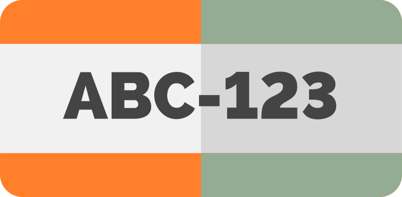

<div align="center">
  <picture>
    
  </picture>
<br>

<h2>Omni-LPR</h2>

[](https://github.com/habedi/omni-lpr/actions/workflows/tests.yml)
[](https://codecov.io/gh/habedi/omni-lpr)
[](https://www.codefactor.io/repository/github/habedi/omni-lpr)
[](https://github.com/habedi/omni-lpr)
[](https://pypi.org/project/omni-lpr/)
[](https://github.com/habedi/chilli/tree/main/examples)
[](https://github.com/habedi/omni-lpr/blob/main/LICENSE)
<br>
[&logo=docker&logoColor=white&style=flat&color=007ec6)](https://github.com/habedi/omni-lpr/pkgs/container/omni-lpr-cpu)
[&logo=docker&logoColor=white&style=flat&color=007ec6)](https://github.com/habedi/omni-lpr/pkgs/container/omni-lpr-openvino)
[&logo=docker&logoColor=white&style=flat&color=007ec6)](https://github.com/habedi/omni-lpr/pkgs/container/omni-lpr-cuda)

A multi-interface (REST and MCP) server for automatic license plate recognition

</div>

---

Omni-LPR is a self-hostable server that provides automatic license plate recognition (ALPR) capabilities via a REST API
and over the Model Context Protocol (MCP).
It can be used both as a standalone ALPR microservice and as an ALPR toolbox for AI agents and LLMs.

### Why Omni-LPR?

Using Omni-LPR can have the following benefits:

- **Decoupling:** your main application can be in any programming language, and it won't need Python or ML dependencies.
- **Multiple Interfaces:** you can use the ALPR service via a standard REST API, or the MCP for AI agent integration.
- **Ready-to-Deploy:** easy to deploy and start with pre-built Docker images.
- **Hardware Acceleration:** support for generic CPUs (ONNX), Intel CPUs (OpenVINO), and NVIDIA GPUs (CUDA).
- **Asynchronous I/O:** built on Starlette for high-performance, non-blocking I/O.
- **Scalability:** the service can be scaled independently of your main application.

> [!IMPORTANT]
> Omni-LPR is in early development, so bugs and breaking API changes are expected.
> Please use the [issues page](https://github.com/habedi/omni-lpr/issues) to report bugs or request features.

---

### Quickstart

```sh
# Install the server
pip install omni-lpr

# Start the server
omni-lpr
```

#### Examples

See the [examples](examples) directory for usage examples.

### Documentation

Check out the [docs](docs) directory for Omni-LPR's documentation.

---

### Feature Roadmap

- **Core ALPR Capabilities & Model Support**
    -   [x] Plate detection (via YOLO-v9 models).
    -   [x] Plate recognition (via character-centric transformer models).
    -   [x] Optimized models for different hardware backends (generic CPUs, Intel CPUs via OpenVINO, and
        NVIDIA GPUs via CUDA).

- **API, Interfaces, and Developer Experience**
    -   [x] MCP interface for AI agent integration.
    -   [x] REST API for all core tool functions available via the MCP interface.
    -   [x] Standardized JSON error responses.
    -   [x] Interactive API documentation (via Swagger UI and ReDoc).
    -   [x] Support for image uploads (`multipart/form-data`) in the REST API as an alternative to Base64-encoded
        image data.

- **Performance and Scalability**
    -   [x] Asynchronous I/O for handling concurrent requests efficiently.
    -   [x] A Prometheus metrics endpoint (`/api/metrics`) for monitoring request latency, throughput, and error rates.
    -   [ ] Request batching for model inference to improve server throughput.

- **Integrations and Ecosystem**
    -   [x] Standalone self-sufficient microservice architecture.
    -   [ ] A Python client library to simplify interaction with the REST API.

- **Deployment and Operations**
    -   [x] Pre-built Docker images for different hardware backends.
    -   [x] Configuration via environment variables and command-line arguments.
    -   [ ] A Helm chart for simplified deployment to Kubernetes clusters.

- **Benchmarks**
    -   [ ] Performance benchmarks for different hardware backends and request types.

---

### Contributing

See [CONTRIBUTING.md](CONTRIBUTING.md) for details on how to make a contribution.

### License

Omni-LPR is licensed under the MIT License (see [LICENSE](LICENSE)).

### Acknowledgements

- This project uses the awesome [fast-plate-ocr](https://github.com/ankandrew/fast-plate-ocr)
  and [fast-alpr](https://github.com/ankandrew/fast-alpr) Python libraries.
- The project logo is from [SVG Repo](https://www.svgrepo.com/svg/237124/license-plate-number).
